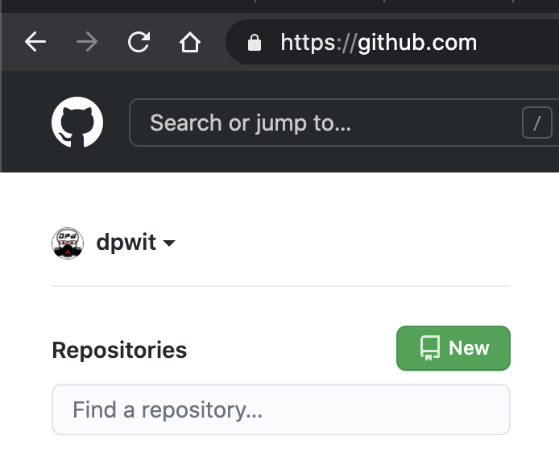
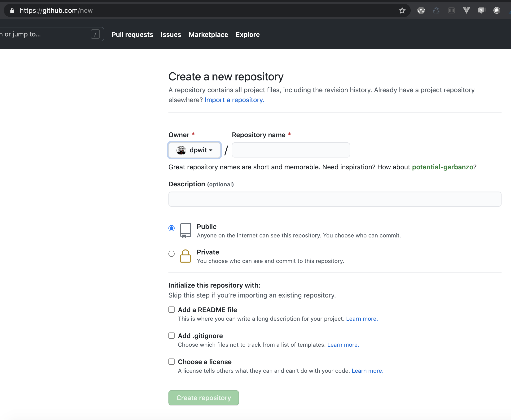
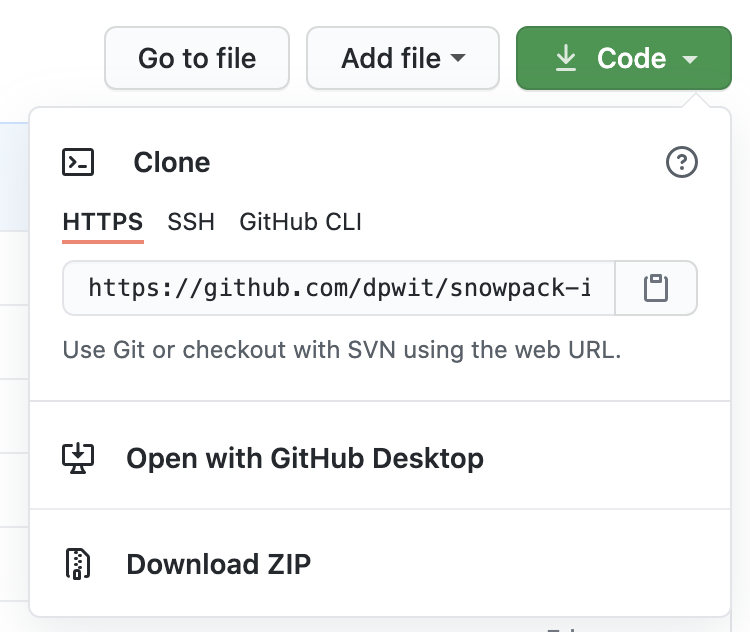
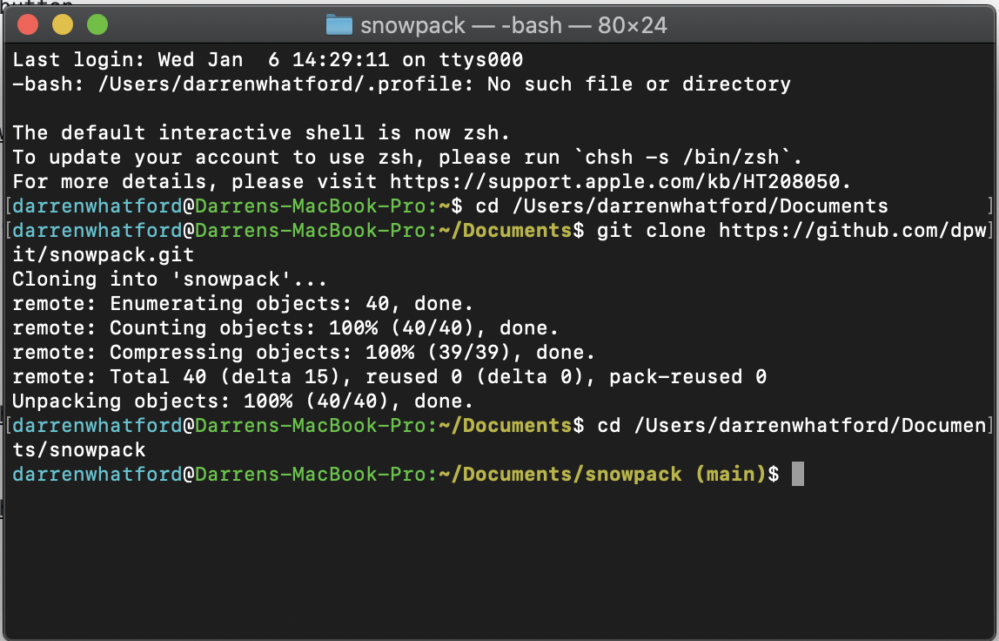

# snowpack
Snowpack install

### Step 1 
- create a new GitHub repo
- Click on the green 'New' button

- Give the repo a meaning full name 
- Select Public
- Select Add a README.md file
- Select Add .gitignore and choose Node from the drop down
- Click on the green Create repository button

### Step 2

- Click the green Code button
- Copy the https github url

<code>
  https://github.com/dpwit/snowpack.git
</code>

### Step 3

- Open Terminal
- cd into Documents
- git clone https://github.com/dpwit/snowpack.git

<code>
  git clone https://github.com/dpwit/snowpack.git
</code>
 
 

- cd into snowpack

 
 

Content

+ bullets
+ bullets

### sub-heading 

Content

<code>
  cd my-first-snowpack
</code>
