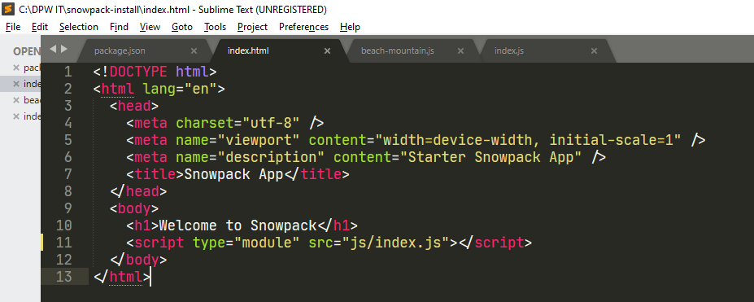
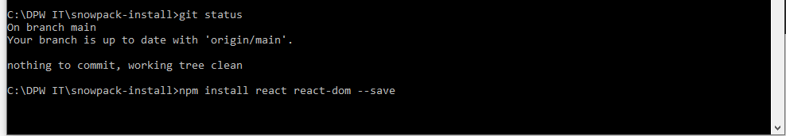

Courtesy of https://www.snowpack.dev/

# What is Snowpack?

Snowpack is a lightning-fast frontend build tool. It is an alternative to heavier, more complex bundlers like webpack. Snowpack uses JavaScript's native module system (known as ESM) to avoid unnecessary work and stay fast no matter how big your project grows.

### How to install Snowpack

### Step 1 
- Create a new GitHub repo
- Click on the green 'New' button


- Give the repo a meaning full name 
- Select Public
- Select Add a README.md file
- Select Add .gitignore and choose Node from the drop down
- Click on the green 'Create repository' button


### Step 2

- Click the green 'Code' button
- Copy the https github url

```
  https://github.com/dpwit/snowpack-install.git
```


### Step 3

- Open Terminal (Mac) Command prompt (Windows)
- cd into Documents
- git clone https://github.com/dpwit/snowpack-install.git

```
  git clone https://github.com/dpwit/snowpack-install.git
```


- cd into snowpack-install


### Snowpack is a package (similar to Webpack) installed via npm. 

- Create a package.json file in the project directory. 
- Run this command in the project to create a package.json file:

```
npm init --y
```


- Install Snowpack as a dev dependancy

```
npm install snowpack --save-dev 
```

- Classic, I can't install Snowpack due to security policy (Zscaler)


- Success on my personal Windows laptop


- Package json file showing snowpack as dev dependancy


### Snowpack's development server

To run Snowpack development server, which is an instant development environment (for unbundled development), add a basic html file. The development server only builds a file when it's requested by the browser, meaning that Snowpack can start up instantly (usually in less than 50ms), which also means it can scale to large projects without slowing down. In contrast, some traditional bundlers (such as Webpack) can take up to 30 seconds for the development environment to start, especially when buildinig large apps.

### Step 4

- Create an index.html file in the root of the project, with the following content...

```
<!DOCTYPE html>
<html lang="en">
  <head>
    <meta charset="utf-8" />
    <meta name="viewport" content="width=device-width, initial-scale=1" />
    <meta name="description" content="Starter Snowpack App" />
    <title>Snowpack App</title>
  </head>
  <body>
    <h1>Welcome to Snowpack</h1>
  </body>
</html>
```


- Add Snowpack development server to the package.json file, as below...

```
 "scripts": {
   "start": "snowpack dev",
    "test": "echo \"Error: no test specified\" && exit 1"
  },
```


- Run the 'start' command to start the Snowpack development server
- Ctrl + c will stop the dev server

```
npm run start
```

If all went well, Snowpack will automatically open the site in a new browser window.


The Snowpack project is now up and running! 

- Change the index.html and save, while the server is running
- The site will refresh and show the changes automatically.

### Using Javascript with Snowpack

Javascript's native ES Module (ESM) syntax is the magic behind Snowpack's unbundled development. The 'import' and 'export' keywords in Javascript (that we're already familiar with) are part or the ESM syntax.

- Create a new Javascript file in a sub folder called js, called beach-mountain.js and export a single beachMountain function

```
//snowpack-install/js/beach-mountain.js
export function beachMountain() {
  console.log('Welcome to Beach Mountain!');
}
```


- Then create an index.js file that imports the new module using ESM syntax

```
//snowpack-install/js/index.js
import { beachMountain } from './beach-mountain.js';

beachMountain();
```


Snowpack scans for files referenced in index.html, so add your index.js to index.html at the bottom of the <body> tag:

```
<body>
    <h1>Welcome to Snowpack!</h1>
    <script type="module" src="js/index.js"></script>
</body>
```



Check your console on your Snowpack site. You should see “Welcome to Beach Mountain!” Try making a change to the module. Snowpack rebuilds that module without rebuilding the rest of your code. Snowpack builds every file individually and caches it indefinitely. Your development environment never builds a file more than once and your browser never downloads a file twice (until it changes). This is the real power of unbundled development, and the secret behind what makes Snowpack so fast.

### Using npm Packages

- Install react

```
$ npm install react react-dom --save
```



Snowpack builds any npm package into ESM web modules. npm packages are mainly published using a module syntax (Common.js, or CJS) that can’t run on the web without some build processing. Even if you write your application using browser-native ESM import and export statements that would all run directly in the browser, trying to import any one npm package forces you back into bundled development.

Snowpack takes a different approach, instead of bundling your entire application for this one requirement, Snowpack processes your dependencies separately. Here’s how it works:

```
node_modules/react/**/*     -> http://localhost:3000/web_modules/react.js
node_modules/react-dom/**/* -> http://localhost:3000/web_modules/react-dom.js
```


1. Snowpack scans your website/application for all used npm packages.
2. Snowpack reads these installed dependencies from your node_modules directory.
3. Snowpack bundles all your dependencies separately into single JavaScript files. For example: react and react-dom convert to react.js and react-dom.js, respectively.
4. Each resulting file runs directly in the browser, and imported via ESM import statements.
5. Because your dependencies rarely change, Snowpack rarely needs to rebuild them.

Once Snowpack has built your dependancies, you can import any package and run it directly in the browser with no bundling. The ability to import npm packages natively in the browser (without a bundler) is the foundation that the rest of Snowpack builds on top of.

Snowpack lets you import npm packages directly in the browser. Even if a package is using a legacy format, Snowpack up-converts the package to ESM before serving it to the browser.

> **_Tip:_**  When you start up your development server or run a new build, you may see a message that Snowpack is “installing dependencies.” This means that Snowpack is converting your dependencies to run in the browser.

### Example task

Install the canvas-confetti package from npm and use it with the following command:

```
npm install canvas-confetti --save //note we just --save this package and not --save-dev as it's not a dependancy
```
